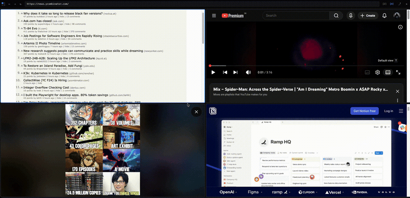

#  Panes — Split Tab Layouts

Split a Chrome tab into 2 or 4 simultaneous web pages, with shared controls in
a single bottom bar. Like Chrome's native split view, but with more panes and a
lot more keyboard.



## Status

`v1.0.0` — first public release. Submission to the Chrome Web Store is
pending; in the meantime, install unpacked using the steps below.

## Install (unpacked)

1. `pnpm install`
2. `pnpm build` — produces `output/chrome-mv3/`.
3. Open `chrome://extensions`, enable **Developer mode**, click **Load
   unpacked**, and pick `output/chrome-mv3/`.
4. Pin the **Panes** action in the toolbar.

## Usage

- Click the toolbar action (or press `⌘/Ctrl+Shift+S`) to open a split tab.
  The current tab's URL preloads into pane 1.
- Click into a pane to focus it. The bottom bar always operates on the focused
  pane.
- The URL bar is editable — press `Enter` to navigate the focused pane.
- `[2]` / `[4]` switches layout. Going from 4 → 2 opens a chooser so you can
  decide which two panes to keep (and optionally move the discarded ones into
  regular tabs). An undo toast lets you revert for 5 seconds.
- `⤴` pops the focused pane out into a real Chrome tab.
- `✕` closes the focused pane (4-pane mode only).
- Drag the splitter between panes to resize. Double-click resets to 50/50.

## Keyboard shortcuts

| Shortcut | Action |
| --- | --- |
| `⌘/Ctrl+Shift+S` | Open a split tab (customizable at `chrome://extensions/shortcuts`) |
| `⌘/Ctrl+Shift+2` | Switch to 2-pane layout |
| `⌘/Ctrl+Shift+4` | Switch to 4-pane layout |
| `⌘/Ctrl+\` | Cycle focus across panes |
| `Alt/Opt+1..4` | Focus pane N directly |
| `⌘/Ctrl+Shift+O` | Pop focused pane out to a real Chrome tab |
| `⌘/Ctrl-click` link | Open link as a real Chrome tab |
| Middle-click link | Open link as a real Chrome tab |

Shortcuts work whether keyboard focus is on the bar or inside a pane.

## What works, what doesn't

Most sites load and stay logged in inside a pane. Verified working:
`github.com`, `news.ycombinator.com`, `stackoverflow.com`, `en.wikipedia.org`,
and most content/docs sites.

Sites that may not render correctly:

- **Banks and other security-sensitive sites** — many actively detect framing
  or sandboxing and refuse to load. This is intentional on their end; Panes
  will not try to bypass it.
- **Some Google properties** (e.g. Docs, Drive surfaces) — these enforce
  framing checks beyond `X-Frame-Options` / CSP and may render blank or kick
  back to their own page.
- **Sites that detect iframe sandboxing** — a small number of sites refuse to
  render in any sandboxed frame. Use the `⤴` pop-out button to recover any
  pane that won't load.

If a pane is misbehaving, pop it out — that's always one click away.

## Privacy

Panes does not collect, transmit, or share any data. The only thing it stores
locally is your last-used layout (`2` or `4`). See [PRIVACY.md](PRIVACY.md)
for details, including a permission-by-permission breakdown.

## Development

Stack: TypeScript (strict), [WXT](https://wxt.dev/), Vite, pnpm. Node `>=22.12`
required.

```bash
pnpm install
pnpm dev          # WXT dev mode with auto-reload
pnpm build        # production build → output/chrome-mv3/
pnpm compile      # type-check only
pnpm zip          # zipped extension for store submission
pnpm icons        # re-render PNG icons from public/icon/icon.svg
```

Project notes for contributors live in [AGENTS.md](AGENTS.md).

## License

[Apache License 2.0](LICENSE). Copyright © 2026 Kumar Anirudha.
